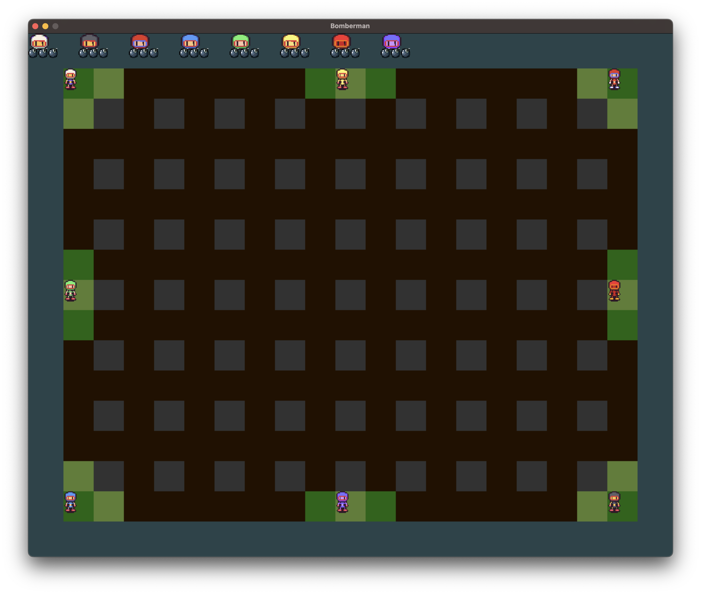

# Bomberman IN104

This project is part of the IN104 course at Ensta Paris where our goal was to develop our own Boomberman is c with SLD2 library.
Boomberman is a game where you have to destroy your opponents with bombs. The game is played on a grid where players can place bombs which explode after a certain time. The explosion of a bomb can destroy the players and the walls. The goal is to be the last player alive.




## **How to play**

In order to play the game, you need to have SDL2 installed on your computer. You can download it [here](https://www.libsdl.org/download-2.0.php).

Then, you can compile the game with the following command:
```bash
$ make
...
$ ./main.x
```

### **Controls**
⚠️ If a controller is connected for a player, the keyboard is disabled.

Keyboard :
(Only the first and second player can play with the keyboard)
- **Player 1**
    - ***ZQSD*** (or ****WASD***) to move
    - ***A*** (or ***Q***) to place a bomb
- **Player 2**
    - ***Arrow keys*** to move
    - ***Space*** to place a bomb

    Keyboard controls can be change in the file data.txt

Controllers :

 ⚠️ This game is only playable with maximum 8 controllers connected and maximum 8 players.

- ***Left stick*** to move
- ***A*** to place a bomb

You may need to connect your controllers and restart the game for it to work properly

### **Paramaters**

Number of players and keyboard controls can be change in the file data.txt.

In the main.c file, some parameters can be changed to modify the game starting at line 84:
 - ```MaxFps``` : the maximum number of frames per second
 - ```DisplayScale``` : the scale of the game window
 - ```nbCellsRow``` : the number of cells in a row of the game grid
 - ```nbCellsCollumn``` : the number of cells in a collumn of the game grid